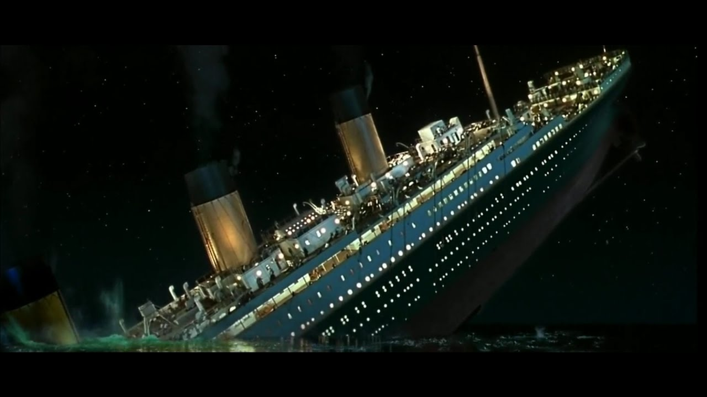

# Titanic
</img>
<h1 align='center'>ANALISANDO O DESASTRE DO TITANIC</h1>

O Navio Titanic afundou nas águas do Oceano Atlântico em 14 de Abril de 1912 quando colidiu as 23h40 contra um iceberg.
Segundo os relatórios da Junta Comercial Britânica 1514 pessoas morreram. Isto serviu como base para a criar de diversas regras de segurança marítima.

<h1>Dados</h1>

Será utilizado os dados coletados na plataforma Kaggle, disponínel em <a href='https://www.kaggle.com/c/titanic'> neste link</a>. Este conjunto de dados possui informações de todos os passageiros, mas sim de apenas 891.

<h1>Perguntas</h1>

Perguntas que gostaria de saber a resposta:
 
 
<li>Quantas pessoas sobreviveram ao desastre, segundo este <i>dataset</i>.</li>
<li>Quantas pessoas não sobreviveram?</li>
<li>A classe que teve maior indice de sobrevivência?</li>
<li>Qual foi a proporção de homens e mulheres que sobreviveram a tragédia?</li>
<li>Quantas crianças sobreviveram?</li>
<li>O capitão afundou com seu navio?</li>
<li>Existia um Jack e uma Rose?</li>

# Requirements
* Python 3.5
* Seaborn
* Matplotlib
* Pandas
* Random
* Jupyter Notebook

# Como contribuir
Caso deseje adicionar informações e melhorias para esse estudo, siga os seguintes passos:

* Fork ou clone este repositório
* Crie um branch com seu nome seguido de sua alteração. Exemplo: john_snow-correcao_ortografica
* Commit suas alterações
* Crie um Pull Request
